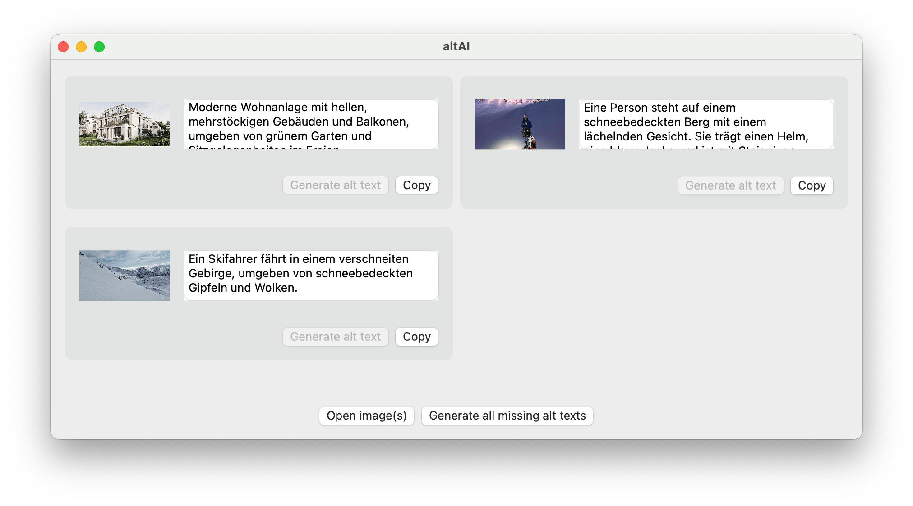
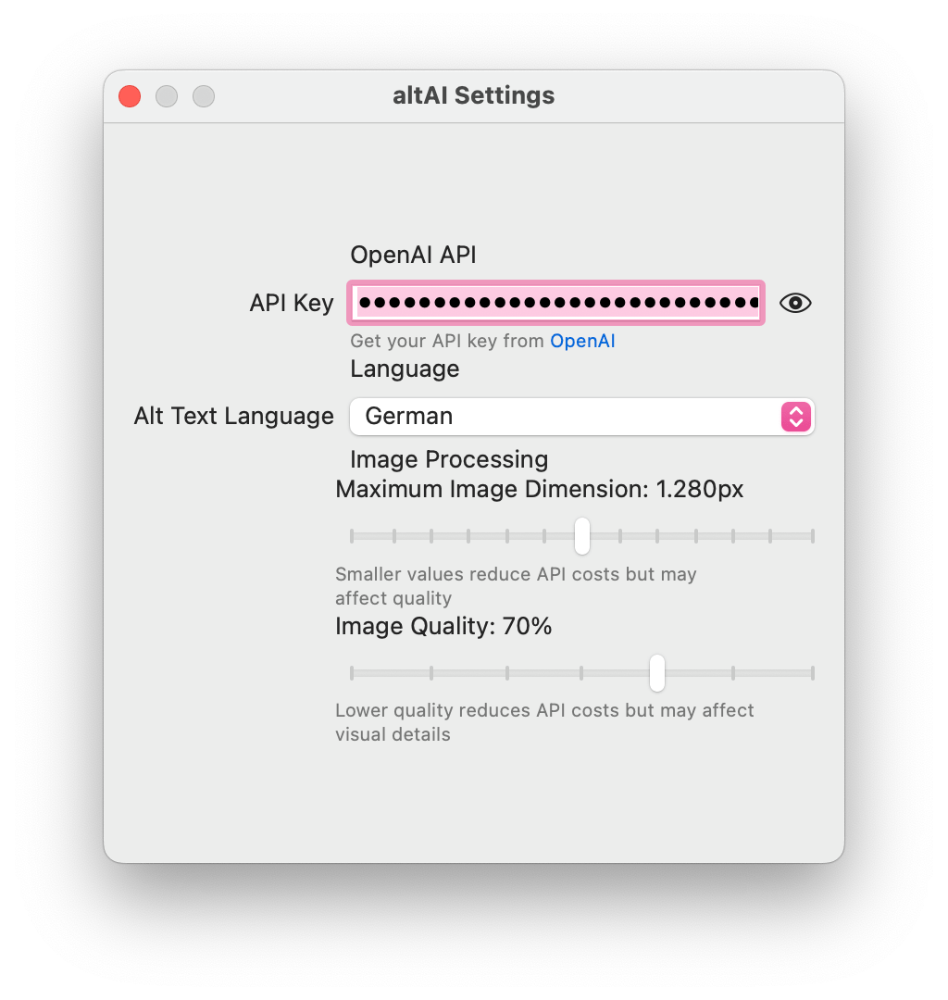

# alt-ai

- Mac app to generate alternative text for images using Open AI API (BYOK)
- Make sure to check if the generated text makes sense and adjust if not
- Using this app will cause costs to the Open AI account for the configured API key
- Warning: I have zero expertise in Swift, this code was entirely written with the help of AI

## Config options
- OpenAI API Key: add your own key, be sure to have enough balance on your account
- The app converts and resizes all images before sending them to Open AI to recude network load and API cost (quality and max length can be configured in settings)

## Screenshots

